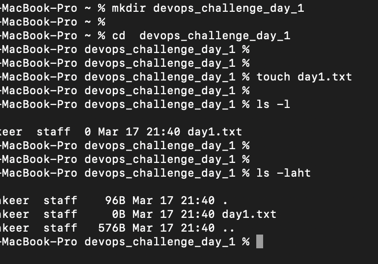
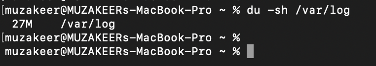
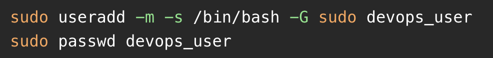
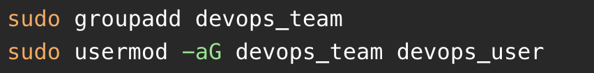
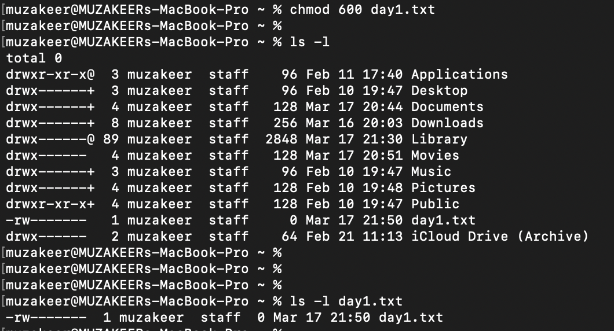
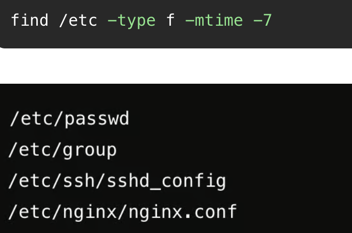
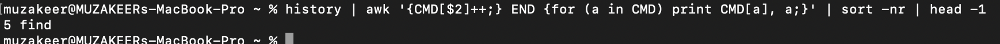

# DevOpsChallenge

## Day 1 - Linux Basics - Commands, File System, Users & Permissions

### 1. Challenge 1: List all files (including hidden ones) in your home directory and sort them by modification time.

### Challenge 2: Create a directory named devops_challenge_day_1, navigate into it, and create an empty file named day1.txt.

### Challenge 3: Find the total disk usage of the /var/log directory in human-readable format.

### Challenge 4: Create a new user called devops_user and add them to the sudo group.

### Challenge 5: Create a group called devops_team and add devops_user to that group.

### Challenge 6: Change the permissions of day1.txt to allow only the owner to read and write, but no permissions for others.

### Challenge 7: Find all files in /etc that were modified in the last 7 days.

### Challenge 8: Write a one-liner command to find the most frequently used command in your shell history.

