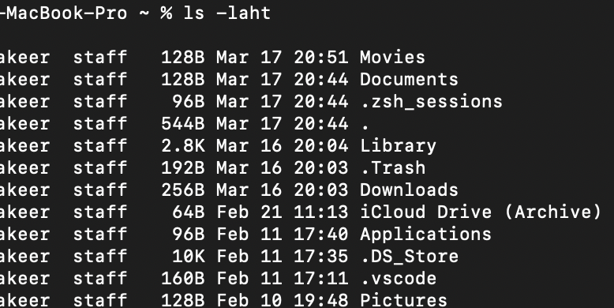

# DevOpsChallenge

# Day 1 - Linux Basics - Commands, File System, Users & Permissions

1. Challenge 1: List all files (including hidden ones) in your home directory and sort them by modification time.

